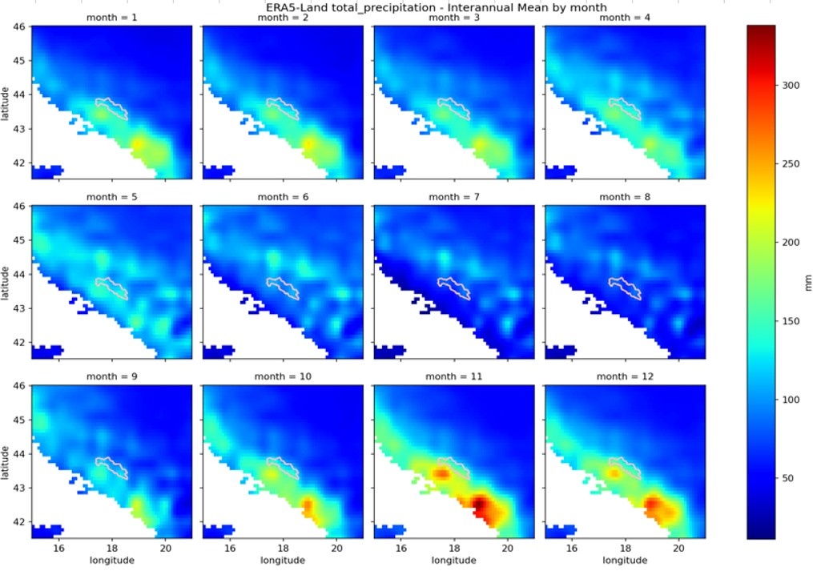
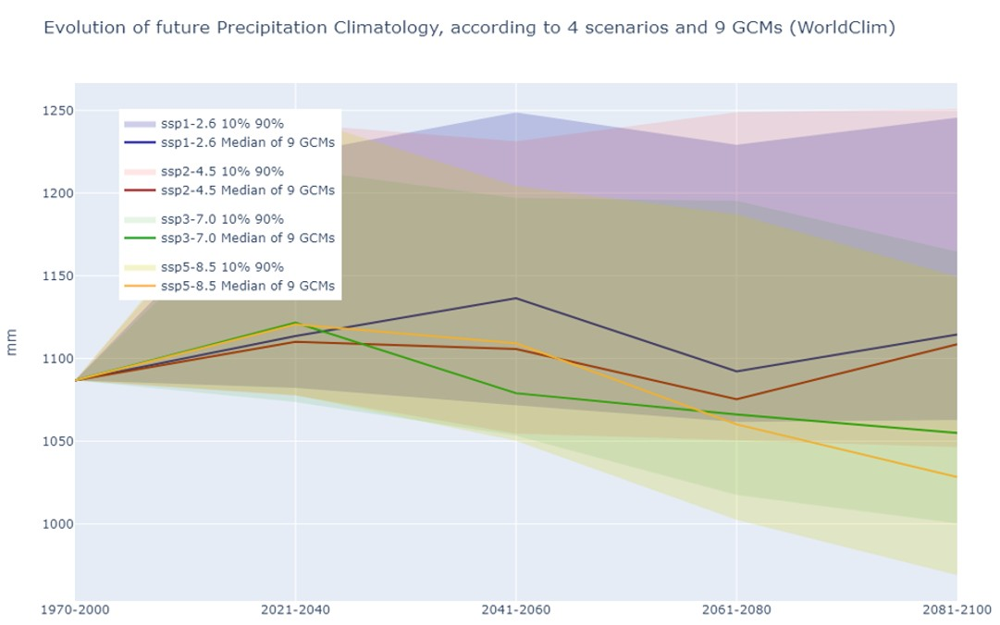
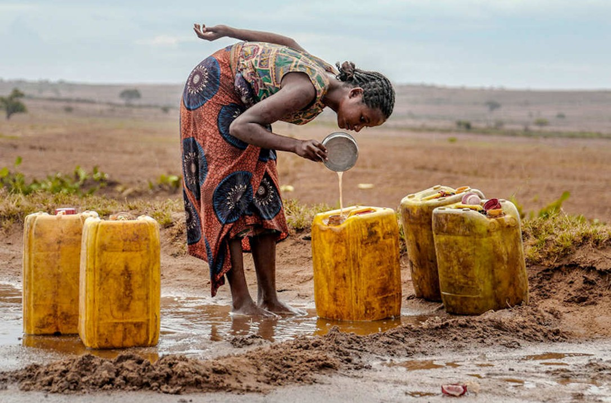
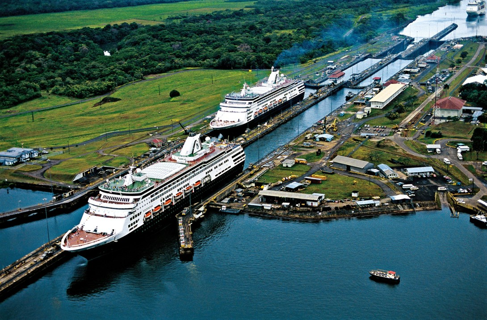
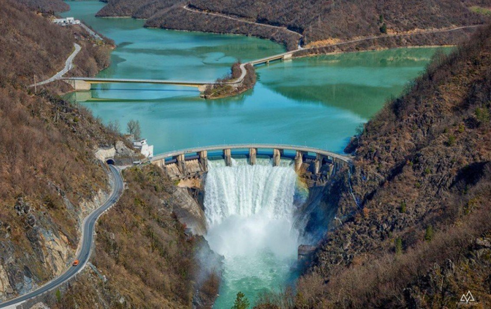

# Prévisions Climatologiques

## Situation

La **Société du Canal de Provence (SCP)** gère l'exploitation d'une grande partie des réseaux d'approvisionnement en eau de la région PACA (canalisations, canaux, barrages, rivières & berges). Elle assure l'alimentation en eau potable de plus de 3 millions de personnes et l'irrigation pour des milliers d'agriculteurs chaque année.

Dans le contexte du changement climatique, un enjeu majeur émerge : **prédire l'évolution de la quantité d'eau disponible**.

Il existe des bases de données issues des simulations ayant servi au GIEC (WorldClim, CHIRPS, ERA5-Land, MSWEP). Problème : ces bases n'ont pas d'API ni de solution d'analyse professionnelle clé en main. 

**Solution** : codes Python privés développés en interne à la SCP pour remplir ce rôle.

## Tâches

- **Prise en main des codes** (1 par base de données) : apprentissage des notions de projections cartographiques "de la terre boule à une carte plane" (bibliothèque Cartopy), compréhension des différents scénarios climatiques et trajectoires d'émission SSP/RCP. *Le code interne est confidentiel, mais [ce script d'illustration](Illustration_projections/Illustration_projections.py) permet d'intuiter l'importance du choix de projection : aucune carte n'est "vraie", il y a différentes manières de représenter la Terre et on choisit la plus adaptée au cas d'étude.*

On peut ainsi obtenir des prévisions :

- **Spatiales / ponctuelles** :

- **Passé vs Futur** :

- **Versioning** : migration des codes de Python 3.8 à 3.11
- **Ajout de nouvelles bases de données** complémentaires
- **Runs pour des études** menées par la SCP

## Accomplissements

- Versioning de 4 notebooks Python 3.8 → 3.11 : **6 erreurs fatales corrigées**
- Ajout de la base **FutureStreams** : avantage majeur par rapport aux autres bases, elle se concentre sur les débits alors que les autres portent généralement sur des caractéristiques météorologiques classiques (pluie, température...)
- Runs effectués pour les études en cours : **Madagascar, Panama, Bosnie**

## Résultats

Application de l'algorithme à 3 cas d'études :

### Madagascar
Estimation de l'évolution du débit d'une nappe phréatique majeure.

### Panama
Analyse de l'intensification des années sèches au Canal de Panama. Enjeu crucial : suite à la sécheresse exceptionnelle de 2023, le commerce mondial transitant par Panama (5% du commerce mondial) a été limité. Le canal fonctionne avec un système d'écluses très gourmand en eau.

### Bosnie
Estimation de l'évolution des capacités hydroélectriques bosnienNes : **-20% d'ici 2050** due à une baisse du débit disponible. Information importante dans le cadre de la décarbonation de l'électricité bosnienne (40% hydroélectrique, le reste provenant encore largement des énergies fossiles dont le charbon).

## Conclusion

Ce projet illustre l'importance croissante des outils d'analyse climatologique dans la gestion des ressources en eau. La capacité à anticiper les évolutions hydrologiques devient un facteur décisif pour l'adaptation aux changements climatiques, que ce soit pour l'approvisionnement en eau potable, l'irrigation agricole ou la production hydroélectrique.

Les trois cas d'études (Madagascar, Panama, Bosnie) démontrent la polyvalence de ces outils et leur pertinence à l'échelle internationale pour éclairer des décisions stratégiques majeures.

---

*Note : Par souci de confidentialité, le code source et les détails techniques approfondis des études ne peuvent être partagés publiquement. Ces outils constituent un avantage concurrentiel pour la SCP face à d'autres firmes ne disposant pas de solution clé en main pour l'analyse précise de la climatologie future d'un lieu donné. Ces analyses sont d'ailleurs de plus en plus sollicitées lors des appels d'offres, soulignant leur valeur stratégique.*
